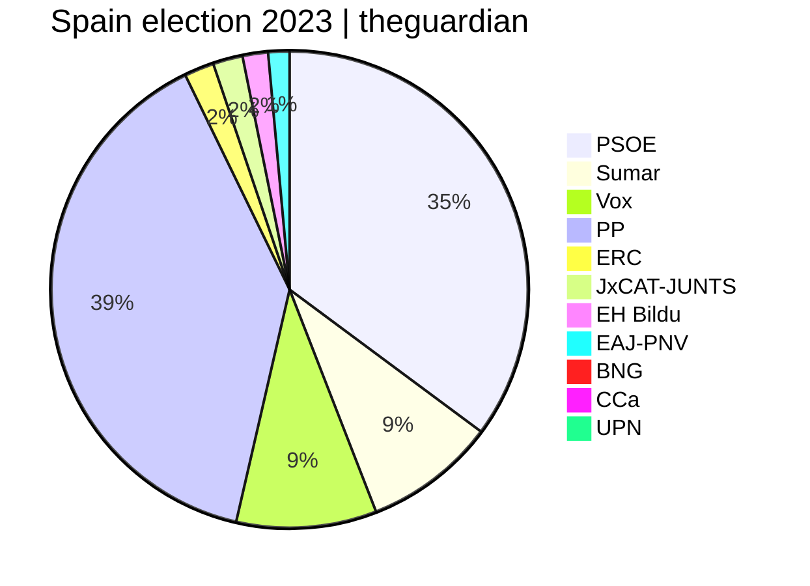

# 스페인 총선 2023년 

https://namu.wiki/w/2023%EB%85%84%20%EC%8A%A4%ED%8E%98%EC%9D%B8%20%EC%B4%9D%EC%84%A0%EA%B1%B0

- 총 350석 과반 175석

322석 주요 4개당

https://www.theguardian.com/world/ng-interactive/2023/jul/23/spain-election-2023-live-results

# 나라별 GDP 순위
https://namu.wiki/w/%EA%B5%AD%EA%B0%80%EB%B3%84%20%EB%AA%85%EB%AA%A9%20GDP%20%EC%88%9C%EC%9C%84

# Earnings 

- 25(화) : Snap, MS, Alphabet
- 26(수) : 메타
- 27(목) : 인텔
- 28(금) : 아마존
  - https://www.investing.com/earnings-calendar/

# 이번 주 주요 일정

- 26일(우리나라 기준 27일 새벽 3시 정도)

  - 6월 신규주택판매
  - FOMC 정례회의(2일차)·기준금리 결정

출처 : 연합인포맥스(http://news.einfomax.co.kr)
